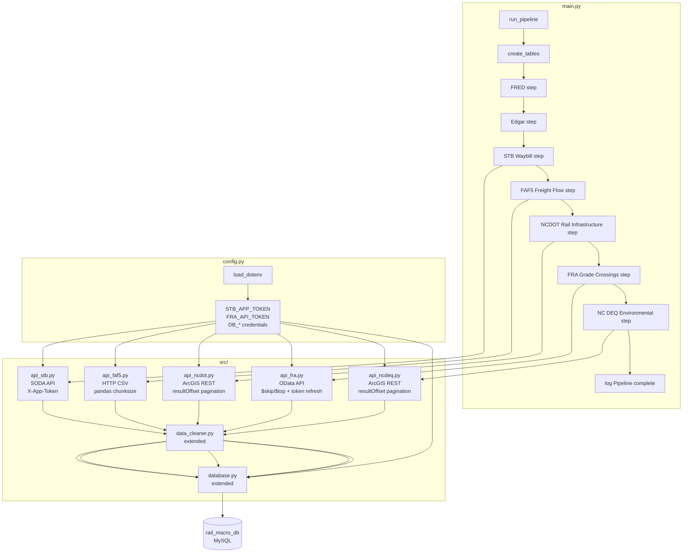

# Design Document: Extended Rail Data Pipeline

## Overview

This document describes the technical design for extending the `rail_macro_db` data pipeline to ingest data from five new sources: STB Waybill, FAF5 Freight Flow, NCDOT Rail Infrastructure, FRA Grade Crossings, and NC DEQ Environmental. The extension follows the existing `fetch → clean → save` pattern established by the FRED and Edgar modules, adds eight new MySQL tables (three of which are spatial), and integrates all new steps into `main.py`.

No visualizations are produced. All data is stored in `rail_macro_db` and deduplicated via `INSERT IGNORE`.

---

## Architecture



All five new fetcher modules use a shared `requests.Session` with an `HTTPAdapter` retry strategy (3 retries, exponential backoff, status codes 429/500/502/503/504). This mirrors the resilience pattern recommended for production HTTP clients and keeps connection pooling efficient.

---

## Components and Interfaces

### config.py — additions

```python
STB_APP_TOKEN: str | None  # loaded from .env STB_APP_TOKEN
FRA_API_TOKEN: str | None  # loaded from .env FRA_API_TOKEN
FAF5_CSV_URL:  str          # public URL for FAF5 CSV download (hardcoded default)
```

### src/api_stb.py

```python
def _make_session() -> requests.Session:
    """Return a Session with retry adapter mounted for http:// and https://."""

def fetch_waybill_records(
    limit: int = 50_000,
    offset: int = 0,
) -> list[dict]:
    """
    Fetch one page of STB waybill records from the Socrata SODA API.
    Sends X-App-Token: STB_APP_TOKEN header.
    Returns list of record dicts, or [] on HTTP error.
    """

def fetch_all_waybill_records() -> list[dict]:
    """
    Paginate the SODA API using $limit/$offset until an empty page is returned.
    Returns the accumulated list of all waybill record dicts.
    """
```

### src/api_faf5.py

```python
def _make_session() -> requests.Session:
    """Return a Session with retry adapter."""

def download_faf5_csv(url: str, dest_path: str) -> bool:
    """
    Stream-download the FAF5 CSV to dest_path using requests streaming.
    Returns True on success, False on HTTP error (logs warning).
    """

def iter_faf5_chunks(
    dest_path: str,
    chunksize: int = 100_000,
) -> Iterator[pd.DataFrame]:
    """
    Yield successive DataFrame chunks from the downloaded CSV file.
    Uses pandas read_csv with chunksize to bound memory usage.
    """
```

### src/api_ncdot.py

```python
_LAYERS: dict[str, str]  # layer_name -> ArcGIS REST query URL

def _make_session() -> requests.Session:
    """Return a Session with retry adapter."""

def fetch_layer(
    url: str,
    layer_name: str,
    max_record_count: int = 1_000,
) -> list[dict]:
    """
    Paginate an ArcGIS REST /query endpoint using resultOffset.
    Requests f=geojson, outFields=*, resultOffset=N, resultRecordCount=max_record_count.
    Stops when exceededTransferLimit is absent/False or feature count < max_record_count.
    Returns list of GeoJSON feature dicts, or [] on error (logs warning).
    """

def fetch_all_layers() -> dict[str, list[dict]]:
    """
    Fetch all three NCDOT layers: rail_lines, rail_crossings, rail_facilities.
    Returns dict mapping layer_name -> list of GeoJSON feature dicts.
    """
```

### src/api_fra.py

```python
@dataclass
class _TokenState:
    token: str
    acquired_at: datetime

def _acquire_token() -> _TokenState:
    """
    POST to FRA token endpoint using FRA_API_TOKEN credential.
    Returns a _TokenState with the bearer token and acquisition timestamp.
    Raises on HTTP error.
    """

def _token_needs_refresh(state: _TokenState, refresh_before_seconds: int = 120) -> bool:
    """
    Return True if the token will expire within refresh_before_seconds
    of the 20-minute (1200s) expiry window.
    Equivalent to: (utcnow() - state.acquired_at).total_seconds() >= 1080
    """

def fetch_all_crossings(
    page_size: int = 1_000,
) -> list[dict]:
    """
    Paginate the FRA OData API using $skip/$top.
    Refreshes the bearer token when within 2 minutes of expiry.
    On HTTP 401: refreshes token once and retries the same page.
    On other HTTP error: logs warning and returns records collected so far.
    Stops when the returned value array is empty.
    Returns accumulated list of crossing record dicts.
    """
```

### src/api_ncdeq.py

```python
_LAYERS: dict[str, str]  # layer_name -> ArcGIS REST query URL

def _make_session() -> requests.Session:
    """Return a Session with retry adapter."""

def fetch_layer(
    url: str,
    layer_name: str,
    max_record_count: int = 1_000,
) -> list[dict]:
    """
    Identical pagination algorithm to api_ncdot.fetch_layer.
    Returns list of GeoJSON feature dicts, or [] on error (logs warning).
    """

def fetch_all_layers() -> dict[str, list[dict]]:
    """
    Fetch all three NC DEQ layers: ust_facilities, ust_incidents, active_landfills.
    Returns dict mapping layer_name -> list of GeoJSON feature dicts.
    """
```

### src/data_cleaner.py — new functions

```python
def clean_stb_records(records: list[dict]) -> list[dict]:
    """
    Drop records where commodity_code or origin_bea is null/empty.
    Coerce routing_miles to float; drop records where coercion fails.
    Returns cleaned list.
    """

def clean_faf5_chunk(chunk: pd.DataFrame) -> pd.DataFrame:
    """
    Drop rows where dms_orig, dms_dest, sctg2, or dms_mode is null.
    Coerce tons, value, tmiles columns to numeric; replace failures with NaN (-> NULL).
    Returns cleaned DataFrame.
    """

def clean_spatial_features(features: list[dict]) -> list[dict]:
    """
    Drop GeoJSON features where geometry is None or coordinates list is empty.
    Used for both NCDOT and NC DEQ layers.
    Returns cleaned list.
    """

def clean_fra_records(records: list[dict]) -> list[dict]:
    """
    Drop records where CrossingID is null or empty string.
    Coerce AADT, NbrTracks, TotalAcc to int; replace failures with None.
    Returns cleaned list.
    """
```

### src/database.py — new functions

```python
def create_tables() -> None:
    """Extended to also create the 8 new tables (see DDL below)."""

def save_stb_waybill(records: list[dict]) -> int:
    """INSERT IGNORE into stb_waybill. Returns newly inserted row count."""

def save_faf5_chunk(chunk: pd.DataFrame) -> int:
    """INSERT IGNORE one DataFrame chunk into faf5_freight_flows. Returns inserted count."""

def save_ncdot_layer(layer_name: str, features: list[dict]) -> int:
    """
    INSERT IGNORE spatial features into the appropriate ncdot_* table.
    Uses ST_GeomFromText(ST_AsText(ST_GeomFromGeoJSON(%s)), 4326) for geometry.
    Returns inserted count.
    """

def save_ncdeq_layer(layer_name: str, features: list[dict]) -> int:
    """
    INSERT IGNORE spatial features into the appropriate ncdeq_* table.
    Uses ST_GeomFromText(ST_AsText(ST_GeomFromGeoJSON(%s)), 4326) for geometry.
    Returns inserted count.
    """

def save_fra_crossings(records: list[dict]) -> int:
    """INSERT IGNORE into fra_grade_crossings. Returns newly inserted row count."""
```

---

## Data Models

### DDL for all 8 new tables

```sql
-- STB Waybill
CREATE TABLE IF NOT EXISTS stb_waybill (
    id              INT AUTO_INCREMENT PRIMARY KEY,
    commodity_code  VARCHAR(10)    NOT NULL,
    stcc_desc       VARCHAR(255),
    origin_bea      VARCHAR(10)    NOT NULL,
    dest_bea        VARCHAR(10),
    routing_miles   DECIMAL(10, 2),
    car_type        VARCHAR(50),
    car_loads       INT,
    fetched_at      TIMESTAMP      DEFAULT CURRENT_TIMESTAMP,
    UNIQUE KEY uq_stb_waybill (commodity_code, origin_bea, dest_bea, car_type)
);

-- FAF5 Freight Flows
CREATE TABLE IF NOT EXISTS faf5_freight_flows (
    id              INT AUTO_INCREMENT PRIMARY KEY,
    dms_orig        VARCHAR(10)    NOT NULL,
    dms_dest        VARCHAR(10)    NOT NULL,
    sctg2           VARCHAR(10)    NOT NULL,
    dms_mode        VARCHAR(10)    NOT NULL,
    tons            DECIMAL(20, 4),
    value_usd_mil   DECIMAL(20, 4),
    tmiles          DECIMAL(20, 4),
    fetched_at      TIMESTAMP      DEFAULT CURRENT_TIMESTAMP,
    UNIQUE KEY uq_faf5 (dms_orig, dms_dest, sctg2, dms_mode)
);

-- NCDOT Rail Lines (spatial)
CREATE TABLE IF NOT EXISTS ncdot_rail_lines (
    id              INT AUTO_INCREMENT PRIMARY KEY,
    objectid        INT            NOT NULL,
    railroad_name   VARCHAR(255),
    track_class     VARCHAR(50),
    geom            LINESTRING     NOT NULL SRID 4326,
    fetched_at      TIMESTAMP      DEFAULT CURRENT_TIMESTAMP,
    UNIQUE KEY uq_ncdot_lines (objectid)
);

-- NCDOT Rail Crossings (spatial)
CREATE TABLE IF NOT EXISTS ncdot_rail_crossings (
    id              INT AUTO_INCREMENT PRIMARY KEY,
    crossing_id     VARCHAR(50)    NOT NULL,
    street_name     VARCHAR(255),
    railroad_name   VARCHAR(255),
    geom            POINT          NOT NULL SRID 4326,
    fetched_at      TIMESTAMP      DEFAULT CURRENT_TIMESTAMP,
    UNIQUE KEY uq_ncdot_crossings (crossing_id)
);

-- NCDOT Rail Facilities (spatial)
CREATE TABLE IF NOT EXISTS ncdot_rail_facilities (
    id              INT AUTO_INCREMENT PRIMARY KEY,
    objectid        INT            NOT NULL,
    facility_name   VARCHAR(255),
    facility_type   VARCHAR(100),
    railroad_name   VARCHAR(255),
    geom            POINT          NOT NULL SRID 4326,
    fetched_at      TIMESTAMP      DEFAULT CURRENT_TIMESTAMP,
    UNIQUE KEY uq_ncdot_facilities (objectid)
);

-- FRA Grade Crossings
CREATE TABLE IF NOT EXISTS fra_grade_crossings (
    id              INT AUTO_INCREMENT PRIMARY KEY,
    crossing_id     VARCHAR(20)    NOT NULL,
    state_code      VARCHAR(5),
    county_name     VARCHAR(100),
    railroad_name   VARCHAR(255),
    street_name     VARCHAR(255),
    crossing_type   VARCHAR(50),
    aadt            INT,
    nbr_tracks      INT,
    total_acc       INT,
    fetched_at      TIMESTAMP      DEFAULT CURRENT_TIMESTAMP,
    UNIQUE KEY uq_fra_crossing (crossing_id)
);

-- NC DEQ UST Facilities (spatial)
CREATE TABLE IF NOT EXISTS ncdeq_ust_facilities (
    id              INT AUTO_INCREMENT PRIMARY KEY,
    facility_id     VARCHAR(50)    NOT NULL,
    facility_name   VARCHAR(255),
    owner_name      VARCHAR(255),
    county          VARCHAR(100),
    geom            POINT          NOT NULL SRID 4326,
    fetched_at      TIMESTAMP      DEFAULT CURRENT_TIMESTAMP,
    UNIQUE KEY uq_ncdeq_ust_fac (facility_id)
);

-- NC DEQ UST Incidents (spatial)
CREATE TABLE IF NOT EXISTS ncdeq_ust_incidents (
    id              INT AUTO_INCREMENT PRIMARY KEY,
    incident_id     VARCHAR(50)    NOT NULL,
    facility_name   VARCHAR(255),
    county          VARCHAR(100),
    incident_date   DATE,
    status          VARCHAR(100),
    geom            POINT          NOT NULL SRID 4326,
    fetched_at      TIMESTAMP      DEFAULT CURRENT_TIMESTAMP,
    UNIQUE KEY uq_ncdeq_ust_inc (incident_id)
);

-- NC DEQ Active Landfills (spatial, mixed point/polygon)
CREATE TABLE IF NOT EXISTS ncdeq_active_landfills (
    id              INT AUTO_INCREMENT PRIMARY KEY,
    objectid        INT            NOT NULL,
    facility_name   VARCHAR(255),
    county          VARCHAR(100),
    permit_number   VARCHAR(50),
    geom            GEOMETRY       NOT NULL SRID 4326,
    fetched_at      TIMESTAMP      DEFAULT CURRENT_TIMESTAMP,
    UNIQUE KEY uq_ncdeq_landfill (objectid)
);
```

### Spatial Insert Pattern

Because we are staying with `mysql-connector-python` (no SQLAlchemy), geometry values from GeoJSON must be converted to WKT before binding as a parameter. The pattern used in all spatial save functions is:

```sql
INSERT IGNORE INTO ncdot_rail_lines (objectid, railroad_name, track_class, geom)
VALUES (%s, %s, %s, ST_GeomFromText(ST_AsText(ST_GeomFromGeoJSON(%s)), 4326))
```

The GeoJSON geometry object is serialized to a JSON string (`json.dumps(feature["geometry"])`) and passed as the `%s` parameter for the geometry column. `ST_GeomFromGeoJSON` parses it, `ST_AsText` converts to WKT, and `ST_GeomFromText(..., 4326)` re-attaches the SRID. This avoids the need for any additional Python spatial library.

---

## Key Algorithms

### FRA Token Refresh

```
state = _acquire_token()          # POST to token endpoint, record datetime.utcnow()

for each pagination page:
    if _token_needs_refresh(state):   # (utcnow() - acquired_at).total_seconds() >= 1080
        state = _acquire_token()

    response = GET /odata?$skip=offset&$top=page_size
               Authorization: Bearer state.token

    if response.status == 401:
        state = _acquire_token()      # refresh once
        response = retry same page
        if response.status != 200:
            log warning; break
    elif response.status != 200:
        log warning; break

    records = response.json()["value"]
    if not records:
        break                         # empty page = end of data

    all_records.extend(records)
    offset += page_size

return all_records
```

The `_token_needs_refresh` check uses `(datetime.utcnow() - state.acquired_at).total_seconds() >= 1080` (18 minutes = 20-minute expiry minus 2-minute buffer).

### ArcGIS REST Pagination Loop

Used identically by both `api_ncdot.py` and `api_ncdeq.py`:

```
offset = 0
all_features = []

while True:
    params = {
        "f": "geojson",
        "outFields": "*",
        "where": "1=1",
        "resultOffset": offset,
        "resultRecordCount": max_record_count,
    }
    response = session.get(url, params=params, timeout=60)

    if response.status_code != 200:
        log warning; break

    data = response.json()

    if "error" in data:
        log warning (data["error"]["message"]); break

    features = data.get("features", [])
    all_features.extend(features)

    exceeded = data.get("exceededTransferLimit", False)
    if not exceeded or len(features) < max_record_count:
        break                         # last page

    offset += len(features)

return all_features
```

The dual termination condition (`exceededTransferLimit` absent/False **or** feature count less than `max_record_count`) handles both well-behaved ArcGIS servers and the known edge case where `exceededTransferLimit` is set even on the final partial page.

### FAF5 Chunked Ingestion

```
1. stream-download CSV to a temp file (tempfile.NamedTemporaryFile, suffix=".csv")
   - use requests streaming: response.iter_content(chunk_size=8192)
   - if HTTP error: log warning, return 0

2. total_inserted = 0
   for chunk in pd.read_csv(temp_path, chunksize=100_000, dtype=str):
       cleaned = clean_faf5_chunk(chunk)
       total_inserted += save_faf5_chunk(cleaned)

3. delete temp file (finally block)
4. return total_inserted
```

Using `dtype=str` on read prevents pandas from silently coercing mixed-type columns before the cleaner runs. The cleaner then applies `pd.to_numeric(..., errors="coerce")` explicitly.

---

## Dependencies

| Package | Version constraint | Purpose |
|---|---|---|
| `requests` | already in requirements.txt | HTTP for all five fetchers |
| `urllib3` | transitive via requests | `Retry` / `HTTPAdapter` |
| `pandas` | already in requirements.txt | FAF5 CSV chunked ingestion |
| `mysql-connector-python` | already in requirements.txt | All DB operations |
| `python-dotenv` | already in requirements.txt | Credential loading |

No new packages are required. `urllib3.util.retry.Retry` is available as a transitive dependency of `requests`. SQLAlchemy and PyMySQL are explicitly **not** added — the spatial insert pattern using `ST_GeomFromGeoJSON` inline in parameterized SQL makes them unnecessary.

### .env additions

```
STB_APP_TOKEN=YOUR_STB_APP_TOKEN_HERE
FRA_API_TOKEN=YOUR_FRA_API_TOKEN_HERE
```

These same lines must appear in `.env.example`.

---

## Correctness Properties

*A property is a characteristic or behavior that should hold true across all valid executions of a system — essentially, a formal statement about what the system should do. Properties serve as the bridge between human-readable specifications and machine-verifiable correctness guarantees.*

### Property 1: Config credential round-trip

*For any* string value set as the `STB_APP_TOKEN` environment variable before `load_dotenv()` is called, `config.STB_APP_TOKEN` should equal that value exactly, with no modification.

**Validates: Requirements 1.5**

---

### Property 2: STB JSON parse round-trip

*For any* list of waybill record dicts serialized as a JSON array and returned by a mocked SODA API response, `fetch_waybill_records()` should return a list of dicts with equivalent field values.

**Validates: Requirements 2.2**

---

### Property 3: Null-key record filtering

*For any* list of records (STB, FAF5, or FRA) where some records have null or empty values in their required key fields (commodity code / origin BEA for STB; origin/destination/commodity/mode for FAF5; crossing ID for FRA), the corresponding cleaner function should return a list containing none of those invalid records, and all records with valid key fields should be retained.

**Validates: Requirements 2.6, 3.6, 5.10**

---

### Property 4: Numeric coercion — drop on failure (STB routing miles)

*For any* STB record where `routing_miles` cannot be coerced to a float (e.g., empty string, `"N/A"`, non-numeric text), `clean_stb_records()` should drop that record from the output. Records with valid numeric `routing_miles` should be retained.

**Validates: Requirements 2.7**

---

### Property 5: Numeric coercion — retain with NULL on failure (FAF5 and FRA)

*For any* FAF5 DataFrame chunk or FRA record list where metric columns (tons/value/ton-miles for FAF5; AADT/NbrTracks/TotalAcc for FRA) contain non-numeric values, the cleaner should retain the row but replace the non-numeric value with `None`/`NaN`. No rows should be dropped solely because a metric column is non-numeric.

**Validates: Requirements 3.7, 5.11**

---

### Property 6: Spatial geometry filtering

*For any* list of GeoJSON features (from NCDOT or NC DEQ) where some features have `None` geometry or an empty coordinates array, `clean_spatial_features()` should return a list containing none of those invalid features, and all features with valid geometry should be retained.

**Validates: Requirements 4.10, 6.10**

---

### Property 7: ArcGIS pagination completeness

*For any* sequence of mocked ArcGIS REST responses where each page except the last has `exceededTransferLimit: true` and a full page of features, the ArcGIS pagination loop should accumulate all features across all pages and return a list whose length equals the sum of features across all pages.

**Validates: Requirements 4.2, 6.2**

---

### Property 8: INSERT IGNORE idempotence

*For any* valid record inserted into any pipeline table (stb_waybill, faf5_freight_flows, ncdot_rail_lines, ncdot_rail_crossings, ncdot_rail_facilities, fra_grade_crossings, ncdeq_ust_facilities, ncdeq_ust_incidents, ncdeq_active_landfills), inserting the same record a second time should not increase the row count in that table. The save function should return 0 on the second call for the same data.

**Validates: Requirements 2.5, 2.8, 3.5, 3.8, 4.7, 4.8, 4.9, 4.12, 5.9, 5.12, 6.7, 6.8, 6.9, 6.12**

---

### Property 9: Save function row count accuracy

*For any* list of N unique records passed to a save function (save_stb_waybill, save_fra_crossings) on a table with no pre-existing matching rows, the function should return exactly N. On a second call with the same records, it should return 0.

**Validates: Requirements 2.9, 5.13**

---

### Property 10: FRA token refresh timing

*For any* `_TokenState` with a recorded `acquired_at` timestamp, `_token_needs_refresh()` should return `True` if and only if `(datetime.utcnow() - acquired_at).total_seconds() >= 1080` (i.e., within 2 minutes of the 20-minute expiry).

**Validates: Requirements 5.2**

---

### Property 11: FRA pagination accumulation

*For any* sequence of mocked FRA OData pages each containing M records (with the final page being empty), `fetch_all_crossings()` should return a list whose length equals the sum of records across all non-empty pages.

**Validates: Requirements 5.3, 5.4, 5.5**

---

### Property 12: Pipeline step resilience

*For any* pipeline step that raises an unhandled exception, all subsequent steps in `run_pipeline()` should still be called. The number of steps called after the failing step should equal the total number of steps minus the position of the failing step.

**Validates: Requirements 7.3**

---

## Error Handling

| Scenario | Behavior |
|---|---|
| HTTP error from any API | Log `WARNING` with status code; return `[]` or `0`; do not raise |
| JSON `"error"` object in ArcGIS response | Log `WARNING` with error message; skip that layer; continue pipeline |
| FRA HTTP 401 | Refresh token once; retry same page; if still failing, log and stop pagination |
| FAF5 download failure | Log `WARNING`; return `0` inserted; temp file cleaned up in `finally` |
| MySQL connection failure | `get_db_connection()` returns `None`; save functions return `0` |
| MySQL insert error | Log `ERROR`; rollback; return `0` |
| Any step exception in `main.py` | Caught by `try/except Exception`; log `ERROR`; continue to next step |
| Null/invalid geometry | Dropped by `clean_spatial_features()` before reaching the database |

All fetcher modules follow the existing pattern from `api_edgar.py` and `api_fred.py`: exceptions are caught at the call site in `main.py`, logged, and the pipeline continues. Individual fetcher functions log warnings for recoverable errors and return empty collections rather than raising.

---

## Testing Strategy

### Unit tests (example-based)

Focus on specific behaviors and integration points:

- Config: verify `STB_APP_TOKEN` and `FRA_API_TOKEN` are loaded from environment
- STB fetcher: verify `X-App-Token` header is present in mocked request
- FAF5 fetcher: verify `chunksize` parameter is passed to `pd.read_csv`
- NCDOT/NC DEQ fetchers: verify all three layer URLs are requested per source
- FRA fetcher: verify token is acquired before first data request; verify 401 triggers one refresh and retry
- Database: verify spatial INSERT SQL contains `ST_GeomFromText(..., 4326)` pattern
- Pipeline: verify `create_tables()` is called once before any fetch step; verify step order; verify "Pipeline complete" log message

### Property-based tests

Use [Hypothesis](https://hypothesis.readthedocs.io/) (Python). Each property test runs a minimum of 100 iterations.

Tag format: `# Feature: extended-rail-data-pipeline, Property N: <property_text>`

| Property | Test approach |
|---|---|
| P1: Config round-trip | `@given(st.text())` — set env var, reload config, assert equality |
| P2: STB JSON parse round-trip | `@given(st.lists(st.fixed_dictionaries({...})))` — mock response, assert output matches input |
| P3: Null-key record filtering | `@given(st.lists(...))` with strategy generating records with random null/valid key fields |
| P4: STB numeric coercion drop | `@given(st.one_of(st.floats(), st.text()))` — verify drop vs retain |
| P5: FAF5/FRA numeric coercion retain | `@given(st.data_frames(...))` — verify non-numeric becomes NaN, row retained |
| P6: Spatial geometry filtering | `@given(st.lists(geojson_feature_strategy()))` — verify null/empty geometry dropped |
| P7: ArcGIS pagination completeness | `@given(st.lists(st.integers(min_value=1, max_value=1000)))` — page sizes, verify total count |
| P8: INSERT IGNORE idempotence | `@given(valid_record_strategy())` — insert twice, verify count unchanged (requires test DB or mock) |
| P9: Save function row count | `@given(st.lists(valid_record_strategy(), min_size=1))` — verify return value equals list length |
| P10: FRA token refresh timing | `@given(st.timedeltas())` — verify refresh predicate matches expected threshold |
| P11: FRA pagination accumulation | `@given(st.lists(st.integers(min_value=0, max_value=500)))` — page sizes, verify total |
| P12: Pipeline resilience | `@given(st.integers(min_value=0, max_value=6))` — which step index raises, verify rest called |

Properties P8 and P9 that require database interaction should use an in-memory SQLite database or a mocked `executemany` cursor to avoid requiring a live MySQL instance in CI.
