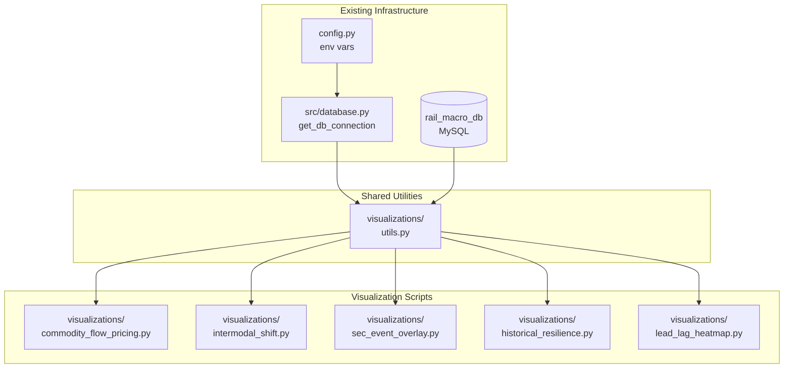
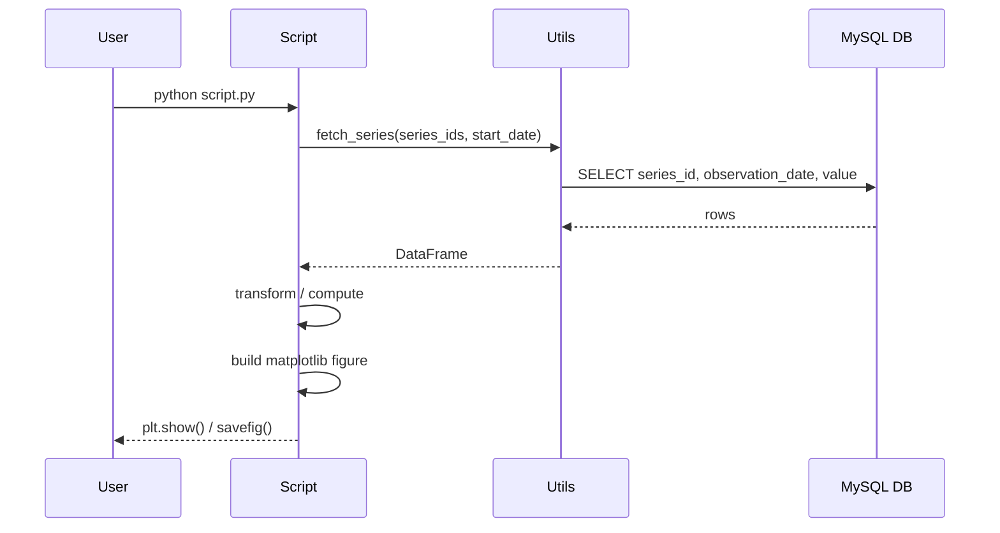

# Design Document: Rail Macro Visualizations

## Overview

This feature adds a suite of five standalone Python visualization scripts that query the existing `rail_macro_db` MySQL database and render financial/economic charts for rail sector analysis. Each script is independently executable, imports shared DB connection utilities from the existing codebase, and produces a self-contained matplotlib figure. The scripts cover macroeconomic pricing dynamics, corporate event overlays, historical resilience modeling, and lead-lag correlation forecasting.

The design reuses `src/database.py`'s `get_db_connection()` and `config.py`'s environment-variable loading pattern. No new database tables or API calls are required — all data is assumed to already be populated by the existing pipeline in `main.py`.

## Architecture



Each visualization script follows the same execution pattern:



## Components and Interfaces

### Component 1: `visualizations/utils.py` — Shared Data Access Layer

**Purpose**: Centralizes all DB queries into reusable functions so each chart script stays focused on rendering logic.

**Interface**:
```python
def fetch_series(
    series_ids: list[str],
    start_date: str | None = None,
    end_date: str | None = None,
) -> dict[str, pd.DataFrame]:
    """
    Query fred_observations for one or more series.
    Returns a dict mapping series_id -> DataFrame with columns:
        observation_date (datetime), value (float)
    Rows with NULL values are dropped.
    """

def fetch_edgar_filings(
    tickers: list[str],
    form_type: str = "10-K",
) -> pd.DataFrame:
    """
    Query edgar_filings for given tickers and form type.
    Returns DataFrame with columns:
        ticker (str), filing_date (datetime), report_date (datetime)
    """

RECESSION_BANDS: list[tuple[str, str]]
# List of (start_date, end_date) strings for official US recessions
# sourced from NBER: 1945-present
```

**Responsibilities**:
- Open/close DB connections safely using `get_db_connection()`
- Parse dates and cast values to float
- Filter by date range when provided
- Expose recession band constants for shading

---

### Component 2: `visualizations/commodity_flow_pricing.py`

**Purpose**: Dual-axis chart plotting Rail Freight Carloads vs. Rail PPI from 2015 onward to test pricing power dynamics.

**Interface**: Standalone script, no importable API. Run with `python visualizations/commodity_flow_pricing.py`.

**Responsibilities**:
- Fetch `RAILFRTCARLOADSD11` and `PCU4821114821114` from 2015-01-01
- Align both series on a shared date index (inner join)
- Plot carloads on left y-axis (blue), PPI on right y-axis (red)
- Annotate correlation coefficient in the chart title or subtitle

---

### Component 3: `visualizations/intermodal_shift.py`

**Purpose**: Comparative time-series from 2000–2026 showing the structural shift from carloads to intermodal.

**Interface**: Standalone script. Run with `python visualizations/intermodal_shift.py`.

**Responsibilities**:
- Fetch `RAILFRTCARLOADSD11` and `RAILFRTINTERMODALD11` from 2000-01-01
- Plot both on the same axis with distinct colors and a legend
- Add a linear trendline for each series using `numpy.polyfit`
- Mark the crossover point (if any) where intermodal volume exceeds carloads

---

### Component 4: `visualizations/sec_event_overlay.py`

**Purpose**: Overlays 10-K filing dates for UNP, CSX, NSC as vertical markers on top of the carloads time series.

**Interface**: Standalone script. Run with `python visualizations/sec_event_overlay.py`.

**Responsibilities**:
- Fetch `RAILFRTCARLOADSD11` for the full available range
- Fetch 10-K filings for UNP, CSX, NSC from `edgar_filings`
- Plot carloads as a line; add color-coded `axvline` markers per ticker
- Include a legend mapping ticker to marker color

---

### Component 5: `visualizations/historical_resilience.py`

**Purpose**: Long-run rail employment chart (back to 1947) with NBER recession shading to measure sector resilience.

**Interface**: Standalone script. Run with `python visualizations/historical_resilience.py`.

**Responsibilities**:
- Fetch `CES4348200001` for the full available range (1947+)
- Shade each NBER recession band in light gray using `axvspan`
- Annotate peak-to-trough drop percentage for each major recession
- Label the x-axis in decade increments for readability

---

### Component 6: `visualizations/lead_lag_heatmap.py`

**Purpose**: Correlation heatmap showing whether drops in rail volume predict drops in PPI or employment at 3, 6, 9-month lags.

**Interface**: Standalone script. Run with `python visualizations/lead_lag_heatmap.py`.

**Responsibilities**:
- Fetch `RAILFRTCARLOADSD11`, `PCU4821114821114`, `CES4348200001`
- Compute Pearson correlation between carloads at time `t` and each target series at `t + lag` for lags in `[1, 2, 3, 6, 9, 12]` months
- Build a 2D correlation matrix (rows = target series, columns = lag months)
- Render as a seaborn `heatmap` with annotated values and a diverging colormap

---

## Data Models

### FRED Query Result

```python
# Returned by fetch_series() per series_id
pd.DataFrame({
    "observation_date": pd.Series(dtype="datetime64[ns]"),
    "value":            pd.Series(dtype="float64"),
})
# Index: RangeIndex (reset after query)
# Sorted ascending by observation_date
# NULL/NaN values dropped
```

### Edgar Filings Query Result

```python
# Returned by fetch_edgar_filings()
pd.DataFrame({
    "ticker":       pd.Series(dtype="str"),
    "filing_date":  pd.Series(dtype="datetime64[ns]"),
    "report_date":  pd.Series(dtype="datetime64[ns]"),
})
```

### Recession Bands Constant

```python
RECESSION_BANDS: list[tuple[str, str]] = [
    ("1948-10-01", "1949-10-01"),
    ("1953-07-01", "1954-05-01"),
    ("1957-08-01", "1958-04-01"),
    ("1960-04-01", "1961-02-01"),
    ("1969-12-01", "1970-11-01"),
    ("1973-11-01", "1975-03-01"),
    ("1980-01-01", "1980-07-01"),
    ("1981-07-01", "1982-11-01"),
    ("1990-07-01", "1991-03-01"),
    ("2001-03-01", "2001-11-01"),
    ("2007-12-01", "2009-06-01"),
    ("2020-02-01", "2020-04-01"),
]
```

### Lead-Lag Correlation Matrix

```python
# Shape: (n_target_series, n_lags)
# Index: series labels (e.g., "Rail PPI", "Employment")
# Columns: lag values in months (e.g., [1, 2, 3, 6, 9, 12])
# Values: Pearson r in [-1.0, 1.0]
pd.DataFrame(dtype="float64")
```

---

## Key Functions with Formal Specifications

### `fetch_series(series_ids, start_date, end_date)`

```python
def fetch_series(
    series_ids: list[str],
    start_date: str | None = None,
    end_date: str | None = None,
) -> dict[str, pd.DataFrame]:
```

**Preconditions:**
- `series_ids` is a non-empty list of strings
- Each string in `series_ids` corresponds to a `series_id` present in `fred_observations`
- `start_date` and `end_date`, if provided, are ISO-format date strings (`"YYYY-MM-DD"`)
- `start_date <= end_date` when both are provided

**Postconditions:**
- Returns a dict with one key per element of `series_ids`
- Each value is a DataFrame sorted ascending by `observation_date`
- All `value` entries are finite floats (NaN rows dropped)
- If no rows match for a series, the DataFrame is empty (not absent from the dict)

**Loop Invariants:** N/A (single SQL query per series, no explicit loops)

---

### `compute_lead_lag_correlation(base, targets, lags)`

```python
def compute_lead_lag_correlation(
    base: pd.Series,          # carloads indexed by date
    targets: dict[str, pd.Series],  # label -> series indexed by date
    lags: list[int],          # lag offsets in months
) -> pd.DataFrame:
```

**Preconditions:**
- `base` is a non-empty `pd.Series` with a `DatetimeIndex`
- Each series in `targets` has a `DatetimeIndex` overlapping with `base`
- All values in `base` and `targets` are finite floats
- `lags` is a non-empty list of positive integers

**Postconditions:**
- Returns a DataFrame with `len(targets)` rows and `len(lags)` columns
- Each cell `[label, lag]` contains the Pearson r between `base[t]` and `targets[label][t + lag]`
- Values are in `[-1.0, 1.0]`; cells with insufficient overlap are `NaN`
- Row index matches keys of `targets`; column index matches `lags`

**Loop Invariants:**
- For each `(label, lag)` pair processed: all previously computed cells remain unchanged

---

### `add_recession_shading(ax, start_date, end_date)`

```python
def add_recession_shading(
    ax: matplotlib.axes.Axes,
    start_date: str | None = None,
    end_date: str | None = None,
) -> None:
```

**Preconditions:**
- `ax` is a valid matplotlib `Axes` object
- `RECESSION_BANDS` constant is defined and non-empty

**Postconditions:**
- Each recession band that overlaps `[start_date, end_date]` is shaded on `ax` using `axvspan`
- No return value; modifies `ax` in place
- Bands outside the visible date range are silently skipped

---

## Algorithmic Pseudocode

### Main Rendering Algorithm (shared pattern for all scripts)

```python
ALGORITHM render_chart()
INPUT: none (reads from DB via utils)
OUTPUT: matplotlib figure displayed to screen

BEGIN
    # Step 1: Fetch data
    data = fetch_series(SERIES_IDS, start_date=START_DATE)
    ASSERT all series in data are non-empty DataFrames

    # Step 2: Align series on common date index
    merged = align_on_date_index(data)
    ASSERT merged has no all-NaN rows after alignment

    # Step 3: Compute derived metrics (script-specific)
    derived = compute_metrics(merged)

    # Step 4: Build figure
    fig, ax = plt.subplots(figsize=(14, 6))
    plot_series(ax, merged, derived)
    apply_styling(ax, title, xlabel, ylabel)

    # Step 5: Display
    plt.tight_layout()
    plt.show()
END
```

### Lead-Lag Correlation Algorithm

```python
ALGORITHM compute_lead_lag_correlation(base, targets, lags)
INPUT:
    base    - pd.Series indexed by datetime (carloads)
    targets - dict[str, pd.Series] indexed by datetime
    lags    - list[int] of month offsets

OUTPUT: pd.DataFrame of shape (len(targets), len(lags))

BEGIN
    result = empty DataFrame, index=targets.keys(), columns=lags

    FOR label, target_series IN targets.items() DO
        FOR lag IN lags DO
            # Shift target series backward by lag months
            shifted_target = target_series.shift(-lag, freq="MS")

            # Align base and shifted target on common dates
            aligned = pd.concat([base, shifted_target], axis=1).dropna()

            IF len(aligned) < MIN_OBSERVATIONS THEN
                result[label][lag] = NaN
            ELSE
                r, _ = pearsonr(aligned.iloc[:, 0], aligned.iloc[:, 1])
                result[label][lag] = r
            END IF
        END FOR
    END FOR

    ASSERT result.shape == (len(targets), len(lags))
    RETURN result
END
```

**Preconditions:** base and all target series have DatetimeIndex; lags are positive integers
**Postconditions:** result values are in [-1.0, 1.0] or NaN; shape is (n_targets, n_lags)
**Loop Invariants:** Previously computed cells are not modified in subsequent iterations

---

## Example Usage

```python
# Run any chart independently:
# $ python visualizations/commodity_flow_pricing.py
# $ python visualizations/intermodal_shift.py
# $ python visualizations/sec_event_overlay.py
# $ python visualizations/historical_resilience.py
# $ python visualizations/lead_lag_heatmap.py

# --- utils.py usage example ---
from visualizations.utils import fetch_series, fetch_edgar_filings

# Fetch two FRED series from 2015 onward
data = fetch_series(
    ["RAILFRTCARLOADSD11", "PCU4821114821114"],
    start_date="2015-01-01",
)
carloads_df = data["RAILFRTCARLOADSD11"]
# carloads_df.columns: ["observation_date", "value"]

# Fetch 10-K filings for UNP and CSX
filings_df = fetch_edgar_filings(["UNP", "CSX"], form_type="10-K")
# filings_df.columns: ["ticker", "filing_date", "report_date"]

# --- Lead-lag heatmap example ---
from visualizations.utils import fetch_series
from scipy.stats import pearsonr
import pandas as pd

data = fetch_series(["RAILFRTCARLOADSD11", "PCU4821114821114", "CES4348200001"])
base = data["RAILFRTCARLOADSD11"].set_index("observation_date")["value"]
targets = {
    "Rail PPI":    data["PCU4821114821114"].set_index("observation_date")["value"],
    "Employment":  data["CES4348200001"].set_index("observation_date")["value"],
}
lags = [1, 2, 3, 6, 9, 12]
corr_matrix = compute_lead_lag_correlation(base, targets, lags)
# corr_matrix is a 2x6 DataFrame ready for seaborn heatmap
```

---

## Correctness Properties

- For all series fetched, `fetch_series` returns DataFrames with no NaN values in the `value` column.
- For all chart scripts, the matplotlib figure is created without raising an exception when the DB contains at least one row for each required series.
- For all lag values `l` in `[1, 2, 3, 6, 9, 12]`, the correlation matrix cell `[label, l]` is either a float in `[-1.0, 1.0]` or `NaN` (never out of range).
- For all recession bands in `RECESSION_BANDS`, `add_recession_shading` applies exactly one `axvspan` per band that overlaps the chart's visible date range.
- For the intermodal shift chart, both trendlines are computed over the same date range as the underlying data (no extrapolation beyond available observations).
- For the SEC event overlay, each filing date marker corresponds to exactly one row in `edgar_filings` with `form_type = '10-K'`.

---

## Error Handling

### Scenario 1: DB Connection Failure

**Condition**: `get_db_connection()` returns `None` (bad credentials, DB offline)
**Response**: Script prints a descriptive error message and exits with code 1 before attempting to render
**Recovery**: User fixes DB connectivity; re-runs the script

### Scenario 2: Empty Result Set for a Series

**Condition**: A required `series_id` has no rows in `fred_observations` (pipeline not yet run)
**Response**: Script prints a warning identifying the missing series and exits gracefully
**Recovery**: User runs `python main.py` to populate data, then re-runs the visualization

### Scenario 3: Insufficient Overlap for Correlation

**Condition**: Two series share fewer than `MIN_OBSERVATIONS = 12` common dates after lag-shifting
**Response**: The affected heatmap cell is set to `NaN` and rendered as a blank/gray cell; a warning is printed to stdout
**Recovery**: No action needed; the chart renders with partial data

### Scenario 4: Missing Edgar Filings

**Condition**: `edgar_filings` table is empty or has no 10-K rows for the target tickers
**Response**: The SEC event overlay chart renders the carloads line without any vertical markers; a warning is printed
**Recovery**: User runs `python main.py` to populate filings data

---

## Testing Strategy

### Unit Testing Approach

Each utility function in `utils.py` should be tested in isolation using `pytest` with a mock DB connection (via `unittest.mock.patch`):
- `test_fetch_series_returns_sorted_dataframe`: Verify output is sorted by date ascending
- `test_fetch_series_drops_null_values`: Verify NaN rows are excluded
- `test_fetch_series_empty_result`: Verify empty DataFrame returned (not exception) when no rows match
- `test_fetch_edgar_filings_filters_by_form_type`: Verify only the requested form type is returned
- `test_compute_lead_lag_correlation_shape`: Verify output shape matches `(n_targets, n_lags)`
- `test_compute_lead_lag_correlation_range`: Verify all non-NaN values are in `[-1.0, 1.0]`

### Property-Based Testing Approach

**Property Test Library**: `hypothesis`

Key properties to test:
- For any list of valid series IDs and any valid date range, `fetch_series` never raises an unhandled exception
- For any two numeric series with at least 12 overlapping points, `compute_lead_lag_correlation` returns values in `[-1.0, 1.0]`
- For any set of recession bands, `add_recession_shading` applies a non-negative number of `axvspan` calls (never negative)

### Integration Testing Approach

- A smoke test that connects to a test DB (or uses a fixture with pre-loaded rows) and runs each chart script's data-fetching logic end-to-end, asserting that a non-empty DataFrame is returned
- Verify that `plt.show()` is not called during tests (mock it out) so tests run headlessly

---

## Performance Considerations

- All queries use indexed columns (`series_id`, `observation_date`) — no full table scans expected
- The longest series (`CES4348200001`, ~900 monthly rows since 1947) is small enough to load entirely into memory without chunking
- Lead-lag correlation computation is O(n_targets × n_lags × n_rows) — negligible for the data sizes involved
- `matplotlib` figure rendering is the dominant cost; no optimization needed

---

## Security Considerations

- DB credentials are loaded from `.env` via `python-dotenv` — never hardcoded in visualization scripts
- All SQL queries use parameterized placeholders (`%s`) to prevent injection
- No user-supplied input is passed to SQL queries at runtime (series IDs and tickers are hardcoded constants)

---

## Dependencies

| Package | Purpose | Already in requirements.txt? |
|---|---|---|
| `matplotlib` | Chart rendering | **No — needs adding** |
| `pandas` | DataFrame manipulation | **No — needs adding** |
| `numpy` | Trendline computation (`polyfit`) | **No — needs adding** |
| `seaborn` | Heatmap rendering | **No — needs adding** |
| `scipy` | Pearson correlation (`pearsonr`) | **No — needs adding** |
| `mysql-connector-python` | DB connection | Yes |
| `python-dotenv` | Env var loading | Yes |

The following packages must be added to `requirements.txt` before running the visualization scripts:

```
matplotlib
pandas
numpy
seaborn
scipy
```
